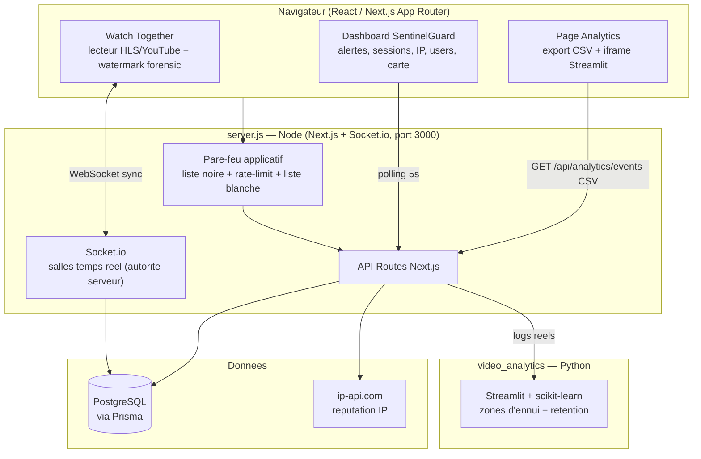

# Architecture — NeoStream

> Plateforme vidéo B2B « V-Secure & Collaborate ». **Une seule plateforme** réunit les 3 pôles : collaboration (Watch Together), sécurité (SentinelGuard) et intelligence (Analyse d'audience). Ce document sert de support aux critères « architecture argumentée » (bloc C) et « intégration » (bloc B).

---

## 1. Vue d'ensemble

*(Le diagramme se rend directement sur GitHub.)*

---

## 2. Le fil rouge (intégration — bloc B)

> **La vidéo diffusée dans Watch Together EST le contenu sensible que SentinelGuard protège, et la source de données qu'Analytics exploite.**

1. **Collaboration** — Un présentateur diffuse une vidéo confidentielle ; les invités suivent en **synchronisation temps réel** (lecteur verrouillé, watermark à leur nom).
2. **Sécurité** — Pendant la session, SentinelGuard qualifie l'IP, surveille les captures d'écran (alerte live au présentateur), détecte connexions simultanées / VPN / voyage impossible, et le pare-feu filtre les accès.
3. **Intelligence** — Chaque play/pause/seek/leave est persisté en `PlaybackEvent` → exporté au format du contrat Data → analysé par le module Python (zones d'ennui + prédiction de rétention).

**Une seule base, une seule auth, un seul serveur** : aucun recâblage entre les pôles.

---

## 3. Décisions d'architecture (et pourquoi)

| Décision | Raison |
|---|---|
| **Serveur Node custom** (`server.js`) au lieu de `next dev` seul | Next App Router ne gère pas les WebSockets persistants → Socket.io attaché au même serveur HTTP (même port, même cookie d'auth). |
| **Pare-feu au point d'entrée HTTP** (pas un middleware Edge) | Le runtime Edge de Next ne peut pas interroger Prisma ; en Node on applique une vraie liste noire DB + rate-limit sur **toutes** les requêtes. |
| **État temps réel en mémoire**, persistance du seul cycle de vie | Latence minimale pour la synchro ; la base ne sert qu'à l'audit et à la télémétrie. |
| **Autorité serveur** pour la synchro | Seuls les events du `hostId` sont acceptés → un invité ne peut pas pirater la lecture. |
| **Position extrapolée** (`positionSec + Δt`) | Un invité qui rejoint en retard se cale à la **bonne** position. |
| **`ip-api.com`** pour la réputation | Réel, sans clé, suffisant pour la démo ; interface isolée (`lib/ip-utils`) donc remplaçable. |
| **Compteurs sécurité en mémoire** (brute-force, rate-limit) | Simplicité et zéro persistance parasite ; acceptable au périmètre hackathon. |
| **Contrat de données CSV** (`SCHEMA_LOGS.md`) | Découple Pôle 1 et Pôle 3 : le module Python importe les logs réels **sans changer une ligne**. |

---

## 4. Stack

**Front / Back** : Next.js 14 (App Router) · React 18 · TypeScript · Socket.io · hls.js · NextAuth · Prisma · Tailwind / shadcn-ui
**Données** : PostgreSQL (Docker)
**IA / Data** : Python · Streamlit · scikit-learn · pandas · Plotly

---

## 5. Cartographie du code

| Domaine | Emplacements clés |
|---|---|
| Temps réel | `server.js`, `server/room-store.js`, `lib/realtime/`, `hooks/use-socket.ts` |
| Lecteur | `components/watch/` (`hls-player`, `youtube-player`, `forensic-watermark`, `room-client`) |
| Pare-feu & réponses | `server/firewall.js`, `lib/auto-block.ts`, `lib/login-guard.ts`, `lib/allow-list.ts`, `lib/session-hygiene.ts` |
| Détections & API sécu | `app/api/security/*`, `lib/security.ts`, `lib/ip-utils.ts` |
| Dashboard | `components/dashboard/*` |
| Analytics (couture) | `app/api/analytics/*`, `video_analytics/` |
| Modèle de données | `prisma/schema.prisma` |
